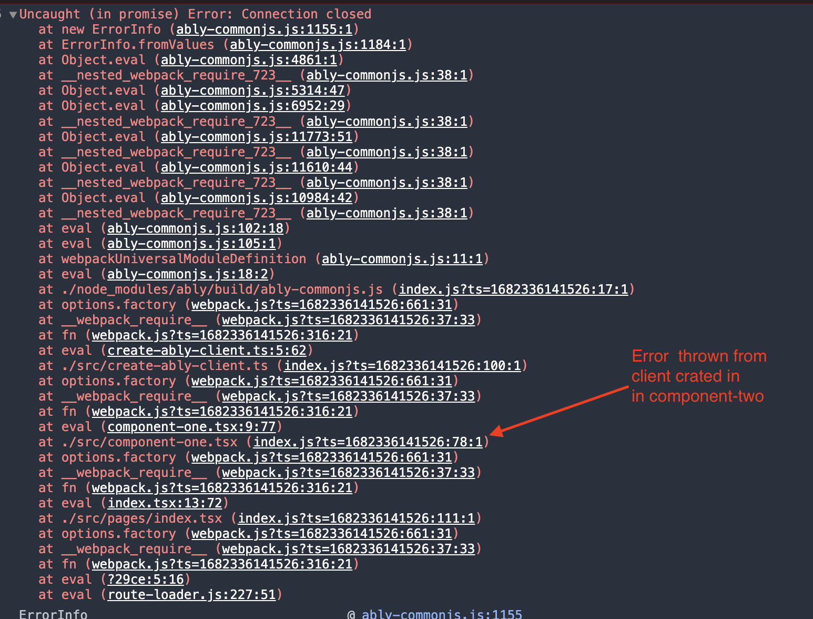

# Reproduce bad callstack

1. Add api keys in `create-ably-client.ts`
2. click the button to disconnect the ably client in ComponentTwo
3. Click the publish button

Notice how the error call stack nowhere mentioned that the error originated in component two, but instead references component one?

